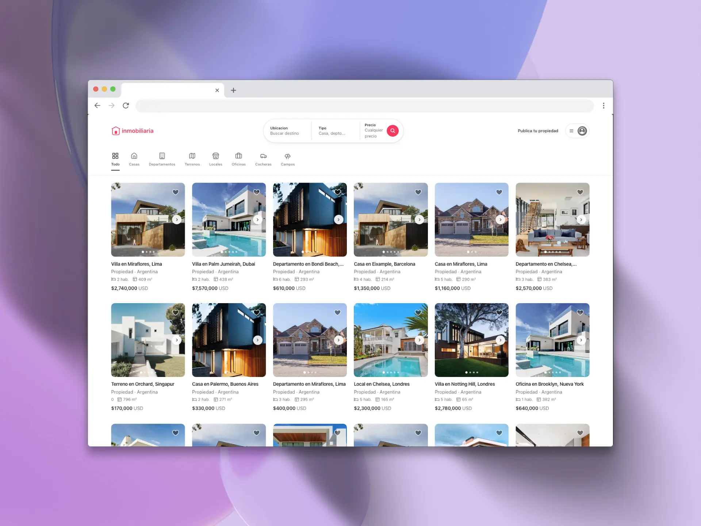

# Real Estate App

A modern real estate platform built with Astro and Contentful, designed to provide a seamless experience for property browsing.

[](https://inmobiliaria.facupm.dev)



## 🚀 Quick Start

```bash
# Install dependencies
pnpm install

# Set up environment variables
cp .env.example .env

# Run development server
pnpm dev
```

## 🛠️ Tech Stack

- **Framework:** [Astro](https://astro.build/)
- **Styling:** [Tailwind CSS](https://tailwindcss.com/)
- **UI Components:** [Shadcn/ui](https://ui.shadcn.com/)
- **CMS:** [Contentful](https://www.contentful.com/)
- **Deployment:** Vercel

## 🔑 Environment Variables

```bash
CONTENTFUL_SPACE_ID=
CONTENTFUL_DELIVERY_TOKEN=
CONTENTFUL_PREVIEW_TOKEN=
PUBLIC_GOOGLE_MAPS_API_KEY=
```

## 📦 Features

- Responsive design
- Fast page loads
- SEO optimized
- Content management with Contentful
- Modern UI components

## 🔨 Development

```bash
# Run development server
pnpm dev

# Build for production
pnpm build

# Preview production build
pnpm preview
```

## 📝 To Do

- [x] Fix clickable area in main page components
- [ ] Add property search functionality
- [ ] Implement contact forms

## 👤 Author

Built with ❤️ by [Facundo Perez Montalvo](https://facuperezm.vercel.app)

[](https://facuperezm.vercel.app/)
[](https://www.linkedin.com/in/facuperezm/)
[](https://github.com/facuperezm)
